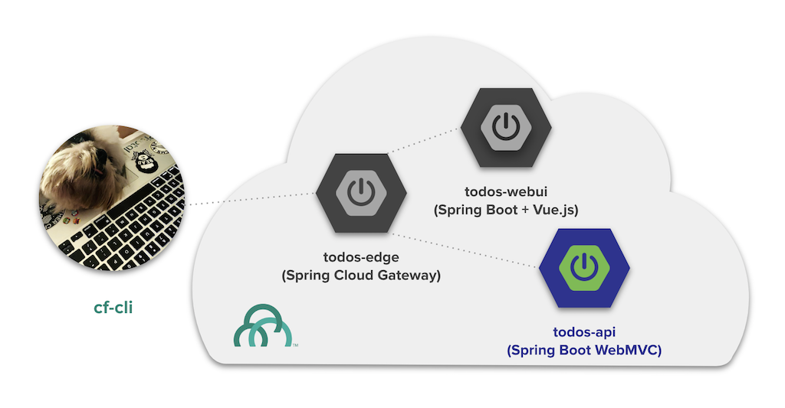
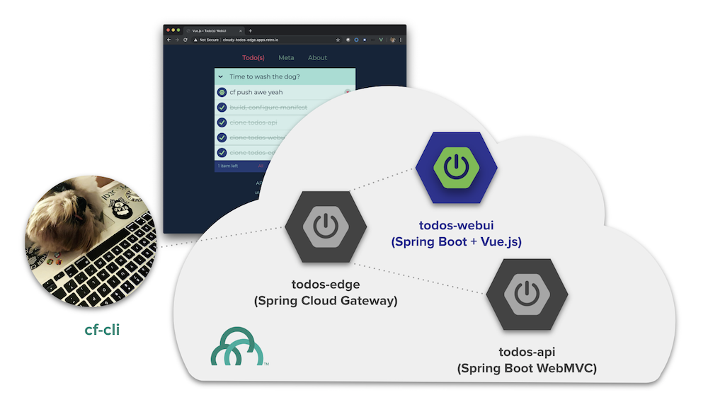
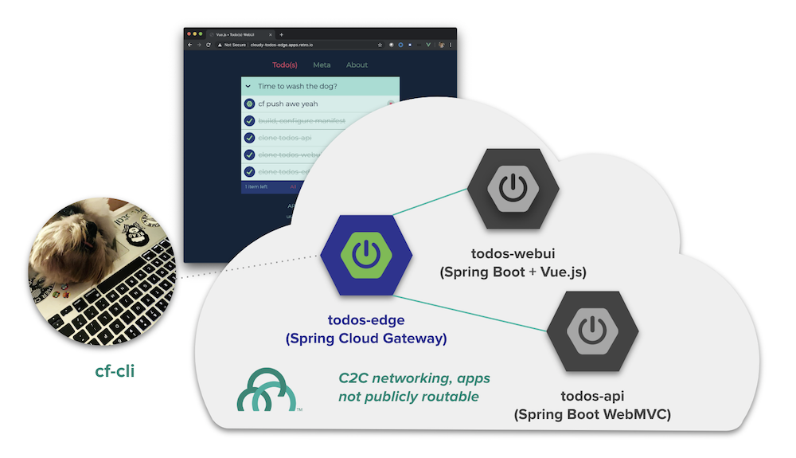
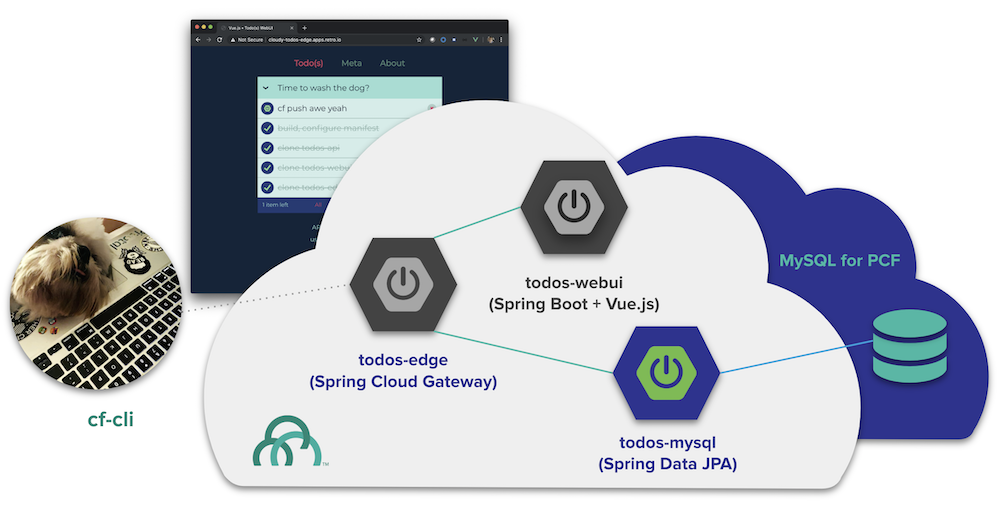
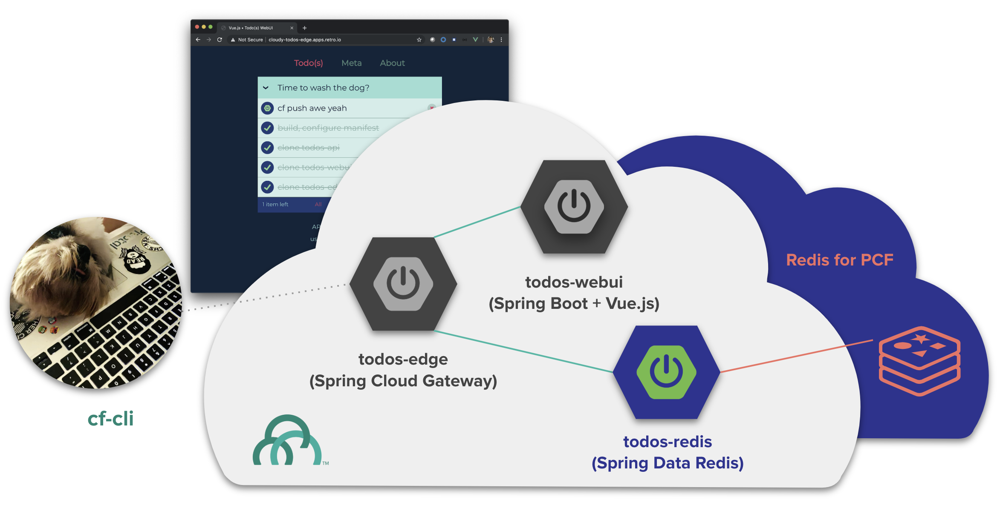

# Howdy and Welcome

What is this?  

Simply put its a playground for all things [Spring Boot](http://spring.io/projects/spring-boot) using the Todo as a domain model. The **"Todo"** is well understood which makes it useful for reasoning about and comparing frameworks.  For example [**TodoMvc**](http://todomvc.com) is a resource developers can use to evaluate frontend frameworks against a concise and consistent model.

This repository contains modules that

* Work together to make a "Todo app"
* Work individually as samples each highlighting a particular feature from [Spring Boot](http://spring.io/projects/spring-boot) and [Spring Cloud](http://spring.io/projects/spring-cloud)
* Work natively on [Platform](https://pivotal.io/platform)
* Could be delivered as part of a [Developer Workshop](/todos-docs/docs/todos-workshop/README.md)

## Playground

### [__todos-api__](/todos-api)

A sample [Spring Boot](https://spring.io/projects/spring-boot) app that uses `spring-boot-starter-web` to implement a Spring MVC based REST API for Todo(s).  This basic sample is used as the default backend for the "Todo app".

### [__todos-webui__](/todos-webui)

A fun sample frontend [Vue.js](https://vuejs.org/) app wrapped in [Spring Boot](https://spring.io/projects/spring-boot) goodness.

### [__todos-edge__](/todos-edge)

Todo(s) Edge is an edge for other Todo apps and serves as a client entry-point into functionality, implemented using [Spring Cloud Gateway](https://spring.io/projects/spring-cloud-gateway).

### [__todos-mysql__](/todos-mysql)

A sample backend implemented in [Kotlin](https://kotlinlang.org) using [Spring Boot](https://spring.io/projects/spring-boot), [Spring Data](https://spring.io/projects/spring-data), [Flyway](https://flywaydb.org/) and [MySQL for PCF](https://docs.pivotal.io/p-mysql/index.html).

### [__todos-redis__](/todos-redis)

A sample backend implemented using [Spring Boot](https://spring.io/projects/spring-boot), [Spring Data Redis](https://spring.io/projects/spring-data-redis) and [Redis for PCF](https://docs.pivotal.io/redis/index.html).

